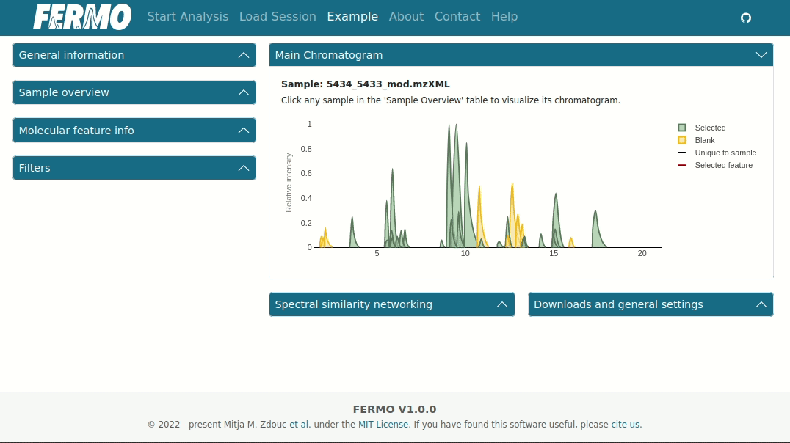

# Usage

The **Dashboard** is the main page of *FERMO GUI*. 
It allows the perform data inspection and analysis and to download generated files for further use.

*Nota bene: this documentation has been written using an example dataset, which can be accessed using the '**Example**' tab in *FERMO Online*. 
The underlying data is a subset from [this study](https://doi.org/10.1021/acs.jnatprod.0c00807) and can be obtained from [Zenodo](https://doi.org/10.5281/zenodo.11961094).*

## Dashboard Elements

### Main chromatogram

The **Main chromatogram** view is the core of the data visualization. 
It allows to access information on molecular features, their annotations, and relatedness.
Clicking a peak triggers the sequence similarity visualization as chromatogram (showing releated features in the active sample) and as network (showing related features in the whole dataset.)

*Nota bene: the peaks (extracted ion chromatograms) are actually pseudo-chromatograms, reconstructed from the peaktable data. They are only an abstraction of the original data and may not always represent the original peak shape appropriately.*

#### Example

In the example, we inspect the molecular feature with the ID 15 by clicking it. 
This feature has multiple related features present in the sample and in the dataset.
When we inspect the *Molecular feature info" we see that it has been annotated as chymostatin-like molecule.

{ width="60%" }

### General information

The **General information** displays a summary of the analysis run.

#### Example

In the example, we see that 143 molecular features from 11 samples were processed.
74 features were removed due to the filter settings. We can also see the run date and the version of `fermo_core` that was used.

{ width="60%" }

### Sample overview

The **Sample overview** gives an overview of the samples in the analysis.
It also shows the **Retained features**, that is, which features have been selected by the filter settings.
Further, it displays [sample scores](../modules/scores.samples.md) and group affiliation of the samples.
A click on a sample name changes the visualization in the **Main Chromatogram**.

#### Example

In the example, we click through some of the samples.
Since we have not set any filters, the numbers in **Total features** and **Retained Features** are identical.
We then look for the sample with the highest diversity, specificity, and mean novelty score.

{ width="60%" }

### Molecular feature info

The **Molecular feature info** gives more information on the selected molecular features.
This includes general information, annotation information, abundance across groups and samples.

#### Example

In the example, we inspect the feature ID 83. 
We see that it has been annotated as a siomycin-like compound.
It also has an annotation to be phenotype-associated.
Further, it has been annotated by the Adduct, Fragment, and Neutral loss modules.

{ width="60%" }

### Spectral similarity networking

The **Spectral similarity networking** displays the spectral similarity network (also known as molecular networks) the selected feature is associated with.
**FERMO** can calculate these networks with different algorithms, which result in different network topologies.

#### Example

In the example, we inspect a network that shows very different topologies dependent on the algorithm used.
We inspect the nodes and edges, and use the network view to quickly cycle through the features.

{ width="60%" }

### Filters

The **Fiters** are a useful element of the data analysis: they allow to quickly focus attention on the most relevant features for the respective research questions.
Filters can be stacked to allow for specific research questions.
The filter settings also update the **Retained features** number in the **Sample overview**. 

*Nota bene: we are currently working on further improving filter settings.*

#### Novelty score filter

Allows to filter for the [**Novelty score**](../modules/scores.features.md).

#### Hide blanks

Allows to hide blank-annotated features (see [here](../modules/metadata.blank.md)).

#### Hide unannotated features

Allows to hide all features that do not have any annotations. 
This also triggers the availability of additional filters.

#### Match score filter

Allows to filter for (spectral) library matches in a certain range.

#### Phenotype score filter

Allows to filter for a [**Phenotype score**](../modules/scores.features.md) in a certain range (only showing phenotype/bioactivity-associated features).

#### Find feature

Allows to search for a specific feature ID.

#### Precursor m/z filter

Allows to search for a precursor m/z range

#### Sample filter

Allows to select features that have been observed in a minimum and/or maximum number of samples.

#### Fold-change filter

Allows to select features that are n-times more abundant across one group versus another group in a certain category.

#### Show only selected group feature

Allows to show only features that are in a selected group

#### Exclude feature with specific network groups

Allows to exclude features that are associated to a certain group from the selection. 
This also extends to all features that are in the same spectral similarity network. 
This can be useful to subtract blank-associated features.

#### Example

In this example, we go through all the filters and observe how they impact the selection.

{ width="60%" }

### Downloads and general settings

This field allows to download the individual files for storage or offline use. 
For more information about the output files, see [**here**](./input_output.md#output-data-formats).

## Display

In *FERMO* v.1.0.0, the dashboard has been completely reworked and now allows for dynamic construction of the user interface.

{ width="60%" }
