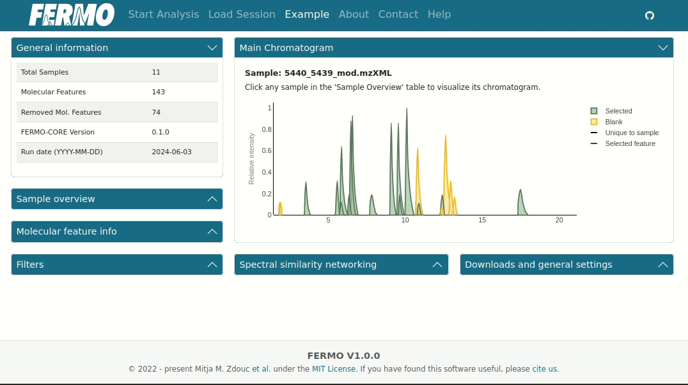
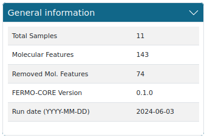
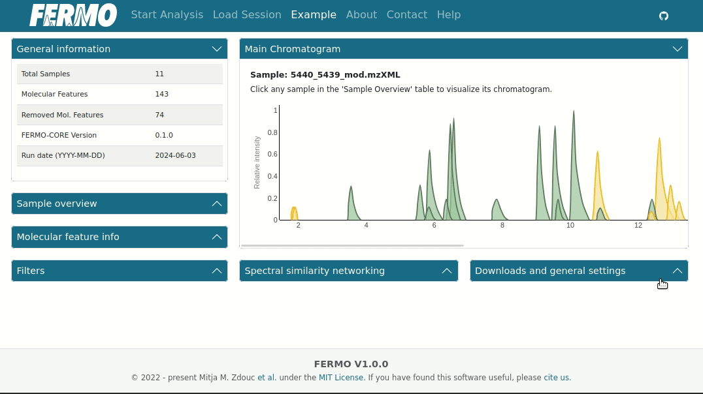

# Usage

The **Dashboard** is the main page of *FERMO GUI*. 
It allows the perform data inspection and analysis and to download generated files for further use.

*Nota bene: this documentation has been written using an example dataset, which can be accessed using the '**Example**' tab in *FERMO Online*. 
The underlying data is a subset from [this study](https://doi.org/10.1021/acs.jnatprod.0c00807) and can be obtained from [Zenodo](https://doi.org/10.5281/zenodo.11961094).*

## Dashboard Elements

### Main chromatogram

The **Main chromatogram** view is the core of the data visualization. 
It allows to access information on molecular features, their annotations, and relatedness.
Clicking a peak triggers the sequence similarity visualization as chromatogram (showing releated features in the active sample) and as network (showing related features in the whole dataset.)

#### Example

In the example, we inspect the molecular feature with the ID 15 by clicking it. 
This feature has multiple related features present in the sample and in the dataset.
When we inspect the *Molecular feature info" we see that it has been annotated as chymostatin-like molecule.

{ width="60%" }

### General information

The **General information** displays a summary of the analysis run.

#### Example

In the example, we see that 143 molecular features from 11 samples were processed.
74 features were removed due to the filter settings. We can also see the run date and the version of `fermo_core` that was used.

{ width="60%" }

### Sample overview

## Display

In *FERMO* v.1.0.0, the dashboard has been completely reworked and now allows for dynamic construction of the user interface.

{ width="60%" }
