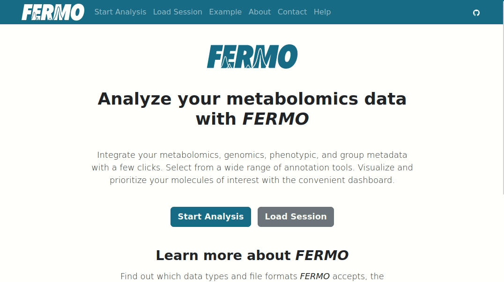

# Usage

On the **'Load Session'** page, existing *FERMO* analysis jobs can be loaded.

The job/session file can be loaded by clicking on the **'Load Session'** button at the bottom of the page.

## Load existing job

This field allows to load an existing *FERMO* job (e.g. created by a colleague). 

Simply paste the *FERMO* job ID into the field, and click on the **'Load Session'** button.

*Nota bene: FERMO jobs are deleted after 30 days. Users are advised to download and store the FERMO session.json files locally.*

#### Example

{ width="60%" }

## Session file upload

This field allows to upload a previously downloaded session.json file. 
This can also be used to reload parameters of a previous job (see [Start Analysis](./gui.start.md) for details).

*Nota bene: session files from FERMO <v1.0.0 are not accepted*

#### Example

{ width="60%" }

