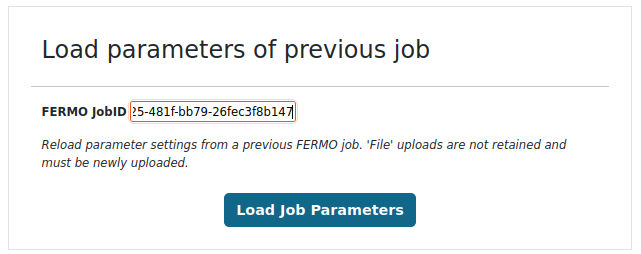
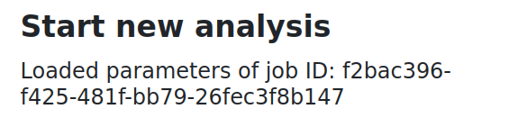

# Usage

On the 'Start Analysis' page, new *FERMO* analysis jobs can be initiated.

Files can be uploaded using the individual upload fields, and the analysis job can be started by clicking on the **'Start Analysis'** button at the bottom of the page.

The **only** file required is a **peaktable file** - all other files are optional, and all parameters are pre-filled with default values which should lead to adequate results in the majority of cases. 
Please **adjust** the parameters according to the **requirements of your data**.

*Nota bene: Due to computational restrains, the FERMO online versions employs some restrictions with regard to file size, computation time, and data storage. Details can be found on the 'Start Analysis' page.*

## Load parameters

This field allows to clone the parameter settings of a previous *FERMO* job (e.g. created by a colleague). 

To load the parameters, simply paste the *FERMO* job ID into the field, and click on the **'Load Job Parameters'** button.

*Nota bene: files and filenames are not retained and must be newly uploaded.*

#### Troubleshooting

If an old job ID does not exist anymore but you still want to clone the parameters, you can simply upload a previously created *FERMO* **session.json** file under [Load Session](./gui.load.md).
Take the newly generated *FERMO* job ID and use it to load the parameters.

#### Example

## Peaktable

The molecular feature peaktable is the only mandatory file for *FERMO* data processing.

Additionally, parameters on the **file format**, **ion polarity**, and **mass deviation** can be set.
[**Adduct annotation**](../modules/annotation.adduct.md) and [**feature filtering**](../modules/filter.feature.md) modules can also be activated.

See [**here**](./input_output.md#molecular-feature-peaktable) for more information on the required peaktable format.

## MS/MS

## Group Metadata

## Phenotype Data

add additional points
