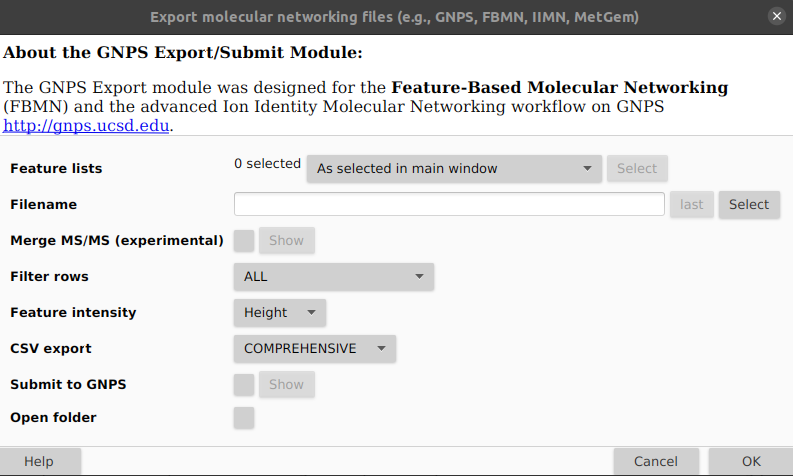

*FERMO* accepts several input data formats and produces a variety of output data files, as described below.

## Input Data Formats

This is a comprehensive list of input data formats currently accepted by *FERMO*. Detailed information can be found below. If your favorite data format is missing, feel free to contact the developers.

<table style="width: 100%;">
  <tr>
    <td style="width: 25%;"><b>Data type</b></td>
    <td style="width: 25%;"><b>Accepted formats</b></td>
    <td style="width: 25%;"><b>Mandatory/Optional</b></td>
    <td style="width: 25%;"><b>Example</b></td>
  </tr>
  <tr>
    <td style="width: 25%;">Molecular feature peaktable</td>
    <td style="width: 25%;">mzmine3</td>
    <td style="width: 25%;">Mandatory</td>
    <td style="width: 25%;"><a href="https://github.com/mmzdouc/fermo_core/blob/main/tests/test_data/test.peak_table_quant_full.csv" target="_blank" rel="noopener noreferrer">mzmine3</a></td>
  </tr>
  <tr>
    <td style="width: 25%;">MS/MS spectrum information</td>
    <td style="width: 25%;">mgf(mzmine3)</td>
    <td style="width: 25%;">Optional</td>
    <td style="width: 25%;"><a href="https://github.com/mmzdouc/fermo_core/blob/main/tests/test_data/test.msms.mgf" target="_blank" rel="noopener noreferrer">mgf(mzmine3)</a></td>
  </tr>
  <tr>
    <td style="width: 25%;">Group metadata</td>
    <td style="width: 25%;">fermo</td>
    <td style="width: 25%;">Optional</td>
    <td style="width: 25%;"><a href="https://github.com/mmzdouc/fermo_core/blob/main/tests/test_data/test.group_metadata.csv" target="_blank" rel="noopener noreferrer">fermo</a></td>
  </tr>
  <tr>
    <td style="width: 25%;">Phenotype/bioactivity data</td>
    <td style="width: 25%;">qualitative,<br>quantitative-percentage,<br>quantitative-concentration</td>
    <td style="width: 25%;">Optional</td>
    <td style="width: 25%;"><a href="https://github.com/mmzdouc/fermo_core/blob/main/tests/test_data/test.bioactivity.qualitative.csv" target="_blank" rel="noopener noreferrer">qualitative</a>,<br><a href="https://github.com/mmzdouc/fermo_core/blob/main/tests/test_data/test.bioactivity.quant-percentage.csv" target="_blank" rel="noopener noreferrer">quantitative-percentage</a>,<br><a href="https://github.com/mmzdouc/fermo_core/blob/main/tests/test_data/test.bioactivity.quant-concentration.csv" target="_blank" rel="noopener noreferrer">quantitative-concentration</a></td>
  </tr>
  <tr>
    <td style="width: 25%;">Spectral library</td>
    <td style="width: 25%;">mgf(GNPS)</td>
    <td style="width: 25%;">Optional</td>
    <td style="width: 25%;"><a href="https://github.com/mmzdouc/fermo_core/blob/main/tests/test_data/test.spectral_library.mgf" target="_blank" rel="noopener noreferrer">mgf(GNPS)</a></td>
  </tr>
  <tr>
    <td style="width: 25%;">MS2Query results file</td>
    <td style="width: 25%;">ms2query(fermo-modified)</td>
    <td style="width: 25%;">Optional</td>
    <td style="width: 25%;"><a href="https://github.com/mmzdouc/fermo_core/blob/main/tests/test_data/test.ms2query_results.csv" target="_blank" rel="noopener noreferrer">ms2query(fermo-modified)</a></td>
  </tr>
  <tr>
    <td style="width: 25%;">AntiSMASH results</td>
    <td style="width: 25%;">antiSMASH(KnownClusterBlast)</td>
    <td style="width: 25%;">Optional</td>
    <td style="width: 25%;"><a href="https://github.com/mmzdouc/fermo_core/tree/main/tests/test_data/JABTEZ000000000.1/" target="_blank" rel="noopener noreferrer">antiSMASH(KnownClusterBlast)</a></td>
  </tr>
</table>

## Output Data Formats

All output files created by *FERMO* are written into a `results` directory that is created in the directory in which the provided peaktable file resides.

All output files are starting with `out.fermo` and ending with a suffix that specifies their type (see the table below):


<table style="width: 100%;">
  <tr>
    <td style="width: 25%;"><b>Suffix</b></td>
    <td style="width: 75%;"><b>Description</b></td>
  </tr>
  <tr>
    <td style="width: 25%;">.session.json</td>
    <td style="width: 75%;">Main output of fermo_core, is used for visualization in fermo_gui</td>
  </tr>
  <tr>
    <td style="width: 25%;">.graphml</td>
    <td style="width: 75%;">Spectral similarity (=molecular) network file, can be imported into Cytoscape</td>
  </tr>
  <tr>
    <td style="width: 25%;">.fermo.abbrev.csv</td>
    <td style="width: 75%;">Feature annotation file, can be imported into Cytoscape</td>
  </tr>
  <tr>
    <td style="width: 25%;">.fermo.full.csv</td>
    <td style="width: 75%;">Modified full peaktable, can be used in downstream processing</td>
  </tr>
  <tr>
    <td style="width: 25%;">.log</td>
    <td style="width: 75%;">A log file describing the steps performed and any warnings/errors that were registered.</td>
  </tr>
  <tr>
    <td style="width: 25%;">.summary.txt</td>
    <td style="width: 75%;">A summary of the steps taken and parameters applied in human-readable form. Can be adapted for the methods section of a manuscript (beware of copy-pasting and a potential flag by a plagiarism software)</td>
  </tr>
</table>

## Details Input Data Formats

### Molecular feature peaktable

The peaktable must:

- Derive from liquid chromatography electrospray ionization (tandem) mass spectrometry **(LC-ESI-(MS/)MS)**
- Constitute of samples acquired at identical **concentration/dilution** and identical **injection volume**
- Be acquired using **untargeted** data-dependent acquisition **(DDA)**
- Be of high resolution (ideally, **<20 ppm** mass deviation)
- Be in a single polarity (either **positive** or **negative** ion mode)


#### mzmine3

Peaktable produced by created by MZmine (version 3.x). To generate the peaktable in MZmine3, perform the usual pre-processing steps and export the table using `Feature list methods -> Export feature list -> Molecular networking files`. In the resulting window (see below), keep defaults except `Filter rows: ALL`, `Feature intensity: Height`, and `CSV export: COMPREHENSIVE`.



For an example, see <a href="https://github.com/mmzdouc/fermo_core/blob/main/tests/test_data/test.peak_table_quant_full.csv" target="_blank" rel="noopener noreferrer">here</a>.

### MSMS spectrum information

#### mgf(mzmine3)

The MS/MS (MS2) fragmentation data file is automatically generated during MZmine (version 3.x) peaktable export (see above).

```
BEGIN IONS
FEATURE_ID=13
PEPMASS=610.3346
SCANS=13
RTINSECONDS=572.766
CHARGE=0+
MSLEVEL=2
98.8724 4.9E1
103.7477 2.9E1
... ...
END IONS
```

### Group Metadata

#### fermo

`.csv`-file (see example below). Specifically, the file must have:

- A single column labeled `sample_name` specifying the samples IDs. Entries in this column must be unique.
- One or more columns specifying group categories. In these columns, all values must be strings (no numbers).

Optionally, the file may have:

- One or more samples designated as sample blanks with the signal word `BLANK`.

```csv
sample_name,phylogroup,medium
sample1.mzXML,group1,mediumA
sample2.mzXML,group1,mediumB
sample3.mzXML,group2,mediumA
sample4.mzXML,group2,mediumB
sample1.mzXML,BLANK,BLANK
sampleN.mzXML,groupX,mediumY
```

### Phenotype (bioactivity) data

#### qualitative

`.csv`-file (see example below). Specifically, the file must have:

- A single column labeled `sample_name` specifying the samples considered “positive”

```csv
sample_name
sample1.mzXML
sample2.mzXML
sample3.mzXML
sampleN.mzXML
```


#### quantitative-percentage

`.csv-file` (see example below). Specifically, the file must have:

- A column labeled `sample_name` specifying the sample identifiers 
- A column labeled `well` specifying the well number. Numbers in this column must be occurring only once. Note that the label `well` stands for any measurement reference (vial, rack position, etc.)
- One to six columns labeled with `assay:...`, which indicate different assays (or one assay at different concentrations).
- Only numeric values in the `assay:...` columns
- Measurements for at least 10 samples

```csv
sample_name,well,assay:assay1_conc1,assay:assay1_conc2,assay2_conc1
sample1.mzXML,1,6,30,98
sample1.mzXML,2,-5,22,80
sample2.mzXML,3,3,15,-20
sample2.mzXML,4,18,17,32
sampleN.mzXML,M,X,Y,Z
```


#### quantitative-concentration

`.csv`-file (see example below). Specifically, the file must have:

- A column labeled `sample_name` specifying the sample identifiers 
- A column labeled `well` specifying the well number. Numbers in this column must be occurring only once. Note that the label `well` stands for any measurement reference (vial, rack position, etc.)
- One to six columns labeled with `assay:...`, which indicate different assays.
- Only numeric values in the `assay:...` columns
- Measurements for at least 10 samples

```csv
sample_name,well,assay:bactericidal
sample1.mzXML,1,256
sample1.mzXML,2,256
sample1.mzXML,3,64
sample1.mzXML,4,32
sample1.mzXML,5,0
sample1.mzXML,6,0
sampleN.mzXML,M,X
```

### Spectral Library

#### mgf(GNPS)

A `.mgf`-file (Mascot generic format) as produced by GNPS. Specifically, this file must:

- Start with `BEGIN IONS`
- Have a `PEPMASS` entry indicating the precursor ion m/z (must not be 0.0 or 1.0)
- Have a number of fragment-intensity pairs
- End with `END IONS`

Optionally, the following fields are supported:
- `SMILES`
- `INCHI` 
- `NAME`

Other fields may be present but are not actively parsed.

```
BEGIN IONS
PEPMASS=1649.45
NAME=Fakeomycin
SMILES=CCCCCC
INCHI=AKFVOKPQHFBYCA
SCANS=1
172.073334	80.0
190.080322	201.0
... ...
END IONS
``` 

### MS2Query Results File

#### ms2query(fermo-modified)

A `.csv-file` (MSQuery version 1.4.0). Specifically, it must have:

- A column labeled `id` with numbers matching molecular feature IDs (not found in standard MS2Query results files
- A column labeled `analog_compound_name`
- A column labeled `ms2query_model_prediction`
- A column labeled `precursor_mz_difference`
- A column labeled `precursor_mz_analog`
- A column labeled `smiles`
- A column labeled `inchikey`
- A column labeled `npc_class_results`

```csv
ms2query_model_prediction,precursor_mz_difference,precursor_mz_query_spectrum,precursor_mz_analog,inchikey,analog_compound_name,smiles,id,npc_class_results
0.3459,47.0324,247.1276,294.1600,AAAAAAAAAA,”fakeomycin”,CCCCC,3,Carboline alkaloids
```

### AntiSMASH Results

#### Online (`fermo_gui`)

In the online version, *FERMO* requires only an existing antiSMASH job ID, which it will use to automatically fetch the required data. 
An antiSMASH job ID has the format `taxon-aaaaaaaa-bbbb-cccc-dddd-eeeeeeeeee`. 
The ID can be found in the antiSMASH notification email or in the URL when browsing the job results.

#### Offline CLI (`fermo_core`)

The `fermo_core` CLI requires a single antiSMASH results directory (at the time of writing, version 7.1) containing a `knownclusterblast` results directory.
